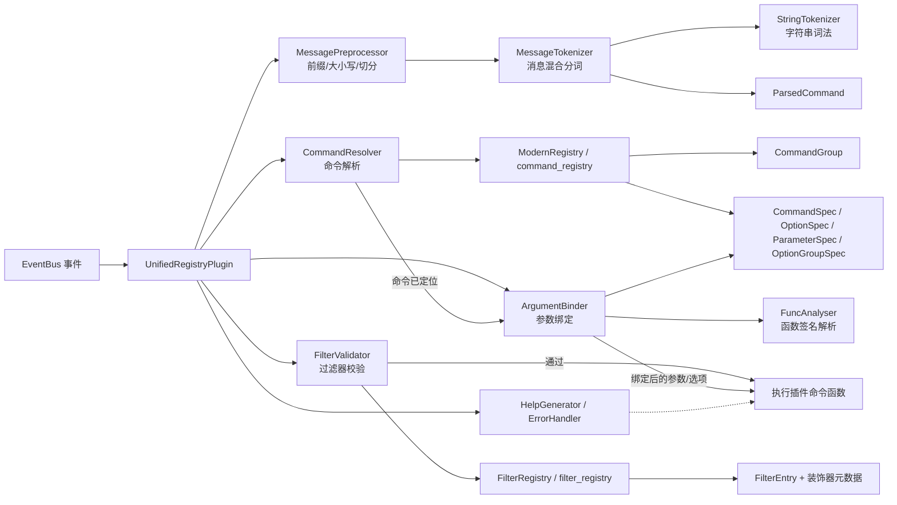
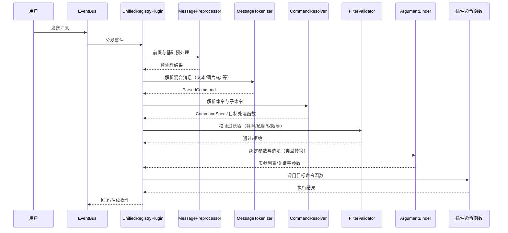
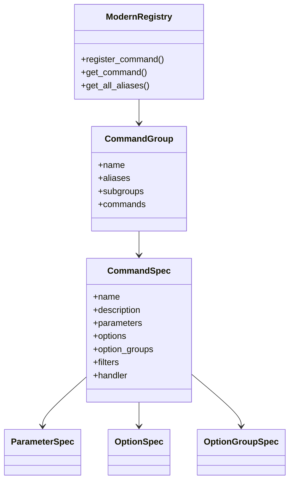
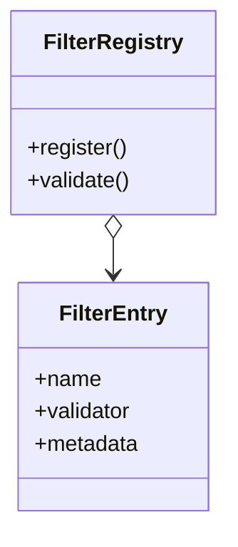

# UnifiedRegistry 模式介绍图

本页用多种 Mermaid 图展示 UnifiedRegistry 的核心模块关系、事件处理流与关键数据结构，便于快速理解整体架构与交互边界。

---

## 高层组件关系（Component）

要点：
- 事件由 `EventBus` 分发到 `UnifiedRegistryPlugin`，随后按“预处理 → 分词 → 解析 → 过滤 → 绑定 → 执行”的主链路推进。
- 命令与过滤器均通过注册表统一管理：`command_registry` 与 `filter_registry`。
- 帮助与错误处理贯穿各阶段，确保良好的开发与使用体验。

---

## 消息到执行的时序（Sequence）

---

## 命令注册结构（Class Diagram）

装饰器生态（示例）：
- `@command_registry.command("name", description=...)`
- `@option("-v", "--verbose", help=...)`
- `@param("target", type=..., help=...)`

---

## 过滤器系统结构（Class Diagram）

典型过滤器：
- 群聊限定、私聊限定、管理员权限、自定义复合过滤器等。

---

## 关键关系与扩展点

- 统一注册：`UnifiedRegistryPlugin` 组合使用 `filter_registry` 与 `command_registry`，并将触发引擎延迟到首次消息时初始化，降低启动成本。
- 可扩展性：
  - 新增命令：通过 `ModernRegistry` 及装饰器完成注册。
  - 新增过滤器：向 `FilterRegistry` 注册 `FilterEntry` 并在命令上附加。
  - 新增参数类型：扩展类型转换器与绑定逻辑，`ArgumentBinder` 会统一接入。

